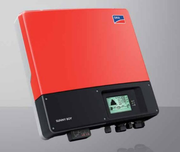

# SMA-SunnyBoy-Modbus
Python solution connecting the SMA Sunnyboy inverters.



## Contents
* [Prerecquisites](#prerecquisites)
* [Usage](#usage)
* [License](#license)
* [Helpful Links](#helpful-links)

## Prerecquisites
1) For the use of this python code it is necessary to install the python libs `pymodbus` and `pyserial`:

```
python3 -m pip install pymodbus<br>
python3 -m pip install pyserial
```
    
> Remark: for `pymodbus` use the minimum version of 3.6.x

2) make sure that your SMA Device supports the modbus protocol
3) make sure that the SMA Device has started/enabled the TCP Server to communicate via modbus

## Usage
Check the python code in the script `sma_modbus.py` and change the settings if necessary.<br>
Especially the ip-address has to be adapted to your settings in the following line:

```
sunny_obj = sunny_boy("192.168.xxx.xxx", UnitID)
```
The device UnitID has the value  `3` as default. If you are not sure you can use the funtion `read_device_unit_id()` to check.<br>
The UnitID can be set to values of `3...123`, the values `1` and `2` are reserved.<br>

Thus the constructor has a default parameter for the UnitID = 3, the instanciation can also be done like:
```
sunny_obj = sunny_boy("192.168.xxx.xxx")
```
### Check the UnitID
```
sunny_obj = sunny_boy("192.168.xxx.xxx")
print(sunny_obj.read_device_unit_id())
```

### Check the communication
After updated the ip and the UnitID if necessary you can check the communication.

```
python3 sma_modbus.py
```


# License
This library is licensed under MIT Licence.

# Helpful Links
* [ESP8266-01-Adapter](https://esp8266-01-adapter.de)
